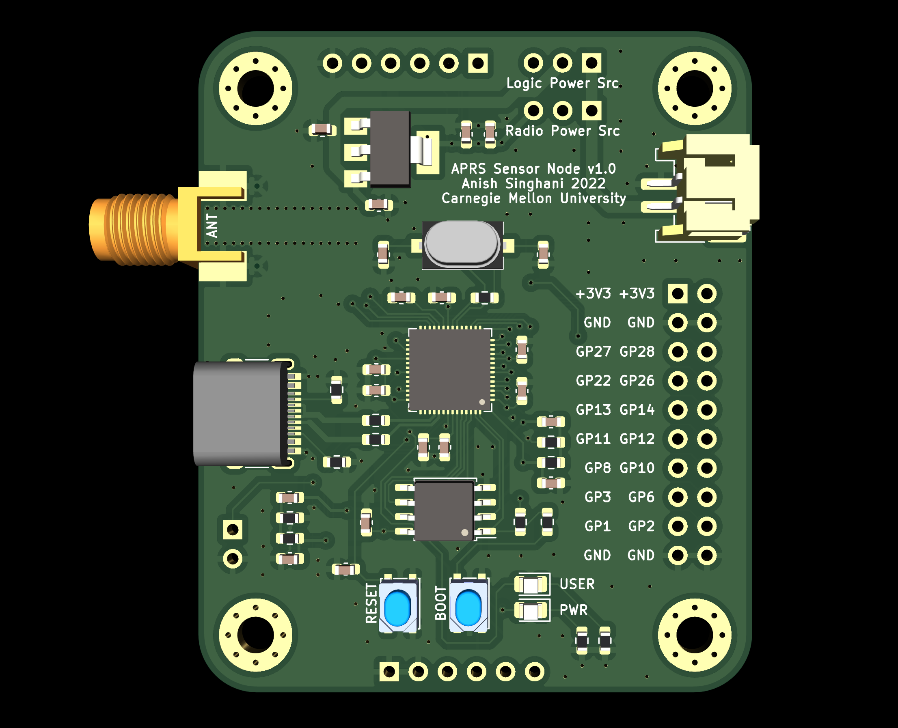
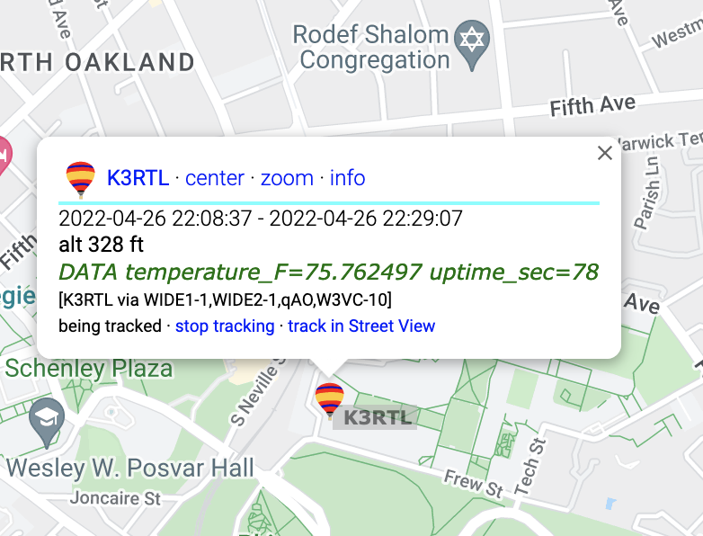

# RP2040 APRS Sensor Node

Cheap, low-power embedded sensor-node powered by an RP2040 microcontroller that communicates over the APRS (Automatic Packet Reporting System) network using the VHF Amateur Radio band.

### Features

- RP2040 microcontroller + flash memory
    - Ability to run MicroPython
- USB-C for power and programming
- JST connector for connecting to LiPo batteries
- 3V3 regulator to power microcontroller (and optionally radio)
- DRA818 VHF 1W/0.5W transceiver
    - Passive bandpass filter converts PWM output to sine-wave for transmission
    - SMA antenna connector (can use a rubber-ducky style HT antenna or an SMA cable to connect to a later antenna)
- Reset & reflash buttons, power & user LEDs
- Power-source jumpers
    - 3V3 regulator can be powered by USB or JST
    - Radio transceiver can be powered directly by JST or thru 3V3 regulator

### Photos

### Example Code

The directory `firmware` includes example code which reads from a [TMP102 temperature sensor](https://www.sparkfun.com/products/13314) and transmits over the APRS network. The pinout for the sensor is defined in `firmware/src/tmp102.c`.

